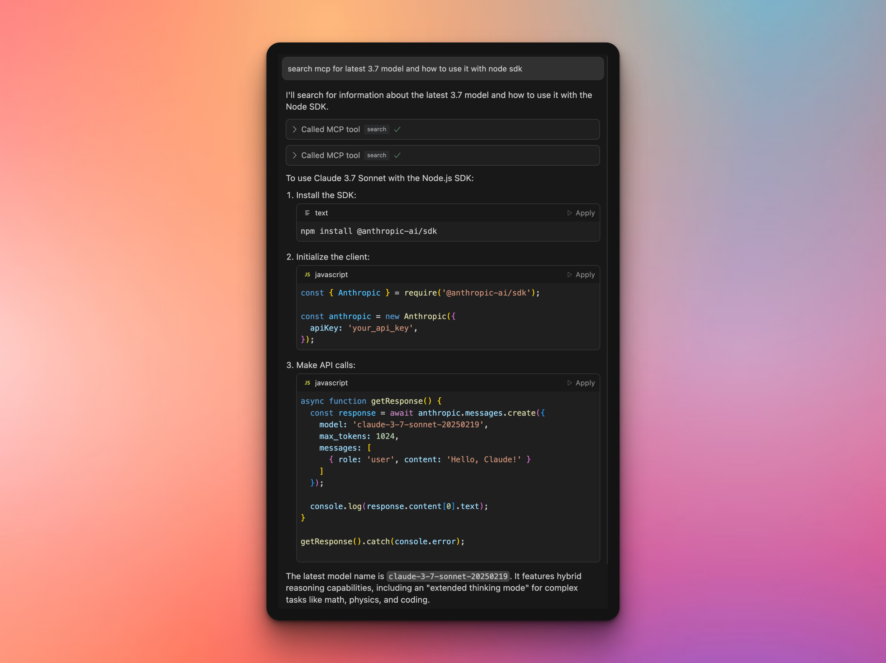

# 🔎 Supercharge Your AI with Web Search Powers

**Save Cursor/Windsurf credits and pay cash instead (it's worth it!)**

Want to give your AI coder the power to search the web without going broke?

That's why I built **4o-mini-search** MCP Server.

And the best thing is, it's super easy to use!

## ✨ What This Does For You

You can search the web through OpenAI's **4o-mini Search** model.

It basically crawls the web, and gives you (or your AI coder) a super helpful answer.

- **Get Docs**: Read the latest docs without searching/copy/pasting
- **Save Money**: Pay just 1-3 cents per search instead of wasting credits.
- **Beginner-Friendly**: Works right out of the box thanks to a simple `npx` command.
- **Super Compatible**: Works seamlessly with Claude, Cursor AI, and other popular MCP clients
- **Flexible APIs**: Use with either OpenAI directly, or OpenRouter.ai!

## 🚀 Quick Start

Could not be easier, all you have to do is add it to your MCP JSON config file.

If you don't know what it is, just give it a quick search like [this one][https://www.google.com/search?q=mcp+setup+cursor+ai].

## 🔧 Setting Up With Claude, Cusor & Co

Just copy the configuration below, and that's it.

Your AI can now search the web at a fraction of the cost!

```json
{
  "mcpServers": {
    "4o-mini-search": {
      "command": "npx",
      "args": ["@rebers/4o-mini-search-mcp"],
      "env": {
        "API_KEY": "your-api-key",
        "PROVIDER": "openai"  // or "openrouter"
      }
    }
  }
}
```

2. Replace `your-api-key` with your actual API key
3. Add to your configuration file
4. Restart your AI application

## 💡 Using Your New Search Power

Once set up, simply ask your AI to search something.

> "search mcp for latest 3.7 model and how to use it with node sdk"
> 
> "search mcp for how nextjs app router works exactly and how to use it"
> 
> "search mcp for for the latest sveltekit templates"

It will then use OpenAI's **4o-mini-search** and deliver fresh information directly to your AI's context!



## 🛠️ Troubleshooting

**Issue**: Server not connecting in Cursor AI
**Fix**: After saving configuration, restart Cursor completely and try again.
